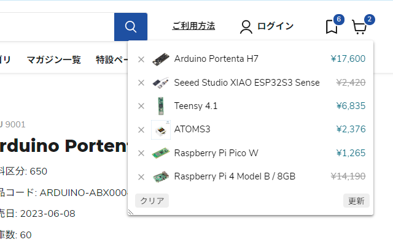
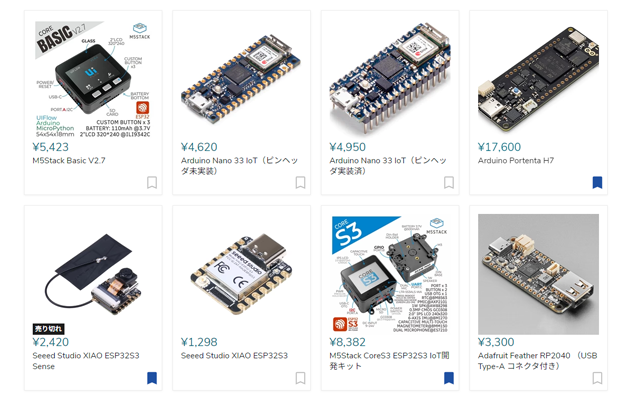

# Chrome Extension for Switch Science 
[スイッチサイエンスのECサイト](https://www.switch-science.com/)
を使いやすくするchrome拡張(非公式)

## Chrome拡張のインストール
[chrome store](https://chrome.google.com/webstore/detail/switch-science-unofficial/ebpjpmfcbhlpnmppdemhoaicbfdeaiam)

## Features

- お気に入り機能を追加
- お気に入り商品の在庫を一括で確認できる
- トップページの商品に価格と在庫を表示
- ヘッダーがスクロールに追随（オプション）
- フォントサイズ変更機能を追加（オプション）

## 制限事項
お気に入りはChromeのストレージ(chrome.storage.local)に保存されます。
chromeアカウントでログインしていても複数の端末でお気に入りを共有することはできません。

## 参考
Based on [akizuki-daisuki](https://github.com/mqce/akizuki-daisuki)
